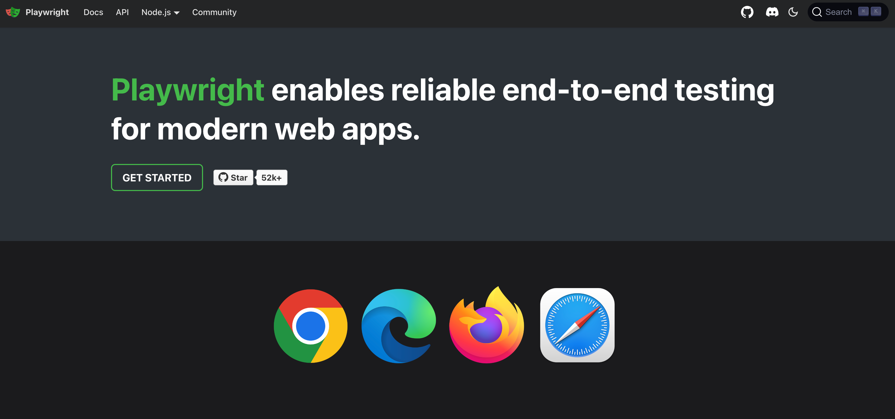

# YOLO Playwright Test Workshop

> 🔥 [Fast and reliable end-to-end testing for modern web apps | Playwright](https://playwright.dev/).

`playwright` is the most recent Test Automation tool​​ in the software testing​​ industry. It is​​ developed and​​ supported by Microsoft​​ and is one of the best tools for UI and API testing.​​ Playwright​​ does not require any complicated configuration. Everything like –​​ Typescript,​​ assertion library, Test runner​​ etc are packed​​ by default​​ inside playwright.

## The goal

This workshop teaches you Playwright Test (PWT) essentials to setup reliable and maintainable end-to-end testing.

Supportive materials and tasks are all included in the `/lessons` directory. The lessons are built on top of each other and are hands-on — **work through them at your own pace**. I'll answer questions on the way and might do the exercises, too.

To follow along, all the examples will test [lab-based user backoffice](http://p-lab_user-admin.p.testenv.io/users).

**But feel free to test and implement functionality on other websites.**

> **Note** You can also find running examples and solutions for each lesson under `/solutions`.

## Action plan

Work through the materials at your own pace. I'll cover lessons every now and then live and will answer questions on the way. Have fun!

[Let's get started](./lessons/pwt-basics/01-getting-started.md)!
