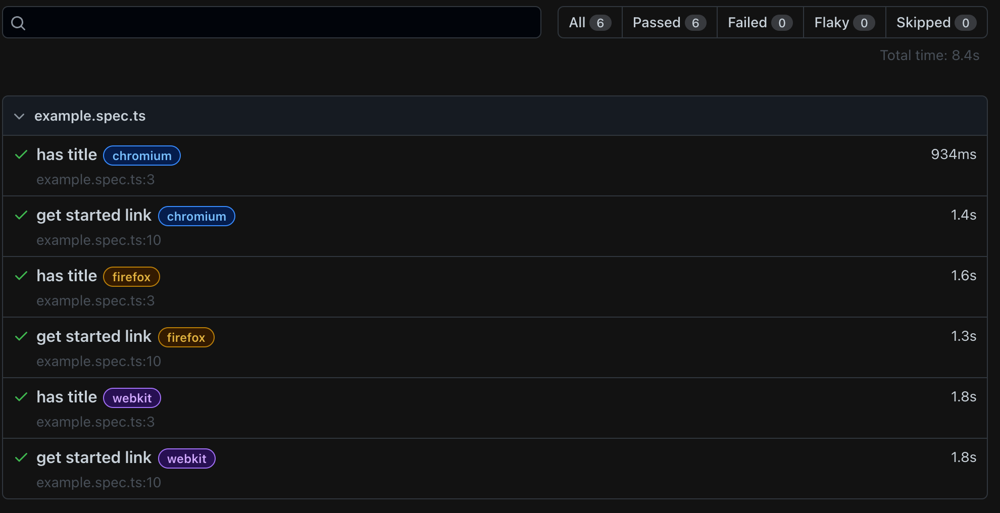

# Get started with `@playwright/test` (`PWT`)

> Get up and running with a new Playwright Test project.


## Install Playwright Test

The best way to get started is the default `init` command.

```bash
➜  yolo-pwt-workshop-solutions npm init playwright@latest
Getting started with writing end-to-end tests with Playwright:
Initializing project in '.'
✔ Do you want to use TypeScript or typescript? · TypeScript
✔ Where to put your end-to-end tests? · tests
✔ Add a GitHub Actions workflow? (y/N) · false
✔ Install Playwright browsers (can be done manually via 'npx playwright install')? (Y/n) · true
Initializing NPM project (npm init -y)…
...
```

Confirm that the installation succeeded by running your first PWT test.

```
➜  yolo-pwt-workshop-solutions npx playwright test

Running 6 tests using 5 workers
  6 passed (8.4s)

To open last HTML report run:

  npx playwright show-report
```

Congratulations! You've just run your first headless PWT tests!

Familiarize yourself with the generated HTML report.

```
npx playwright show-report
```



Use the `--headed` flag to see your new end-to-end automation in action.

```
npx playwright test --headed
```

---

Let's get started and give you [a headstart by recording your first test](./02-first-test.md)!
