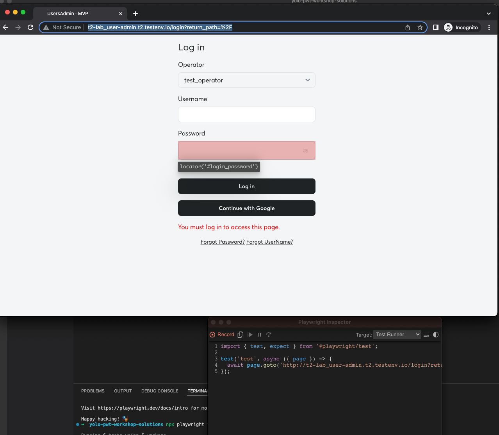
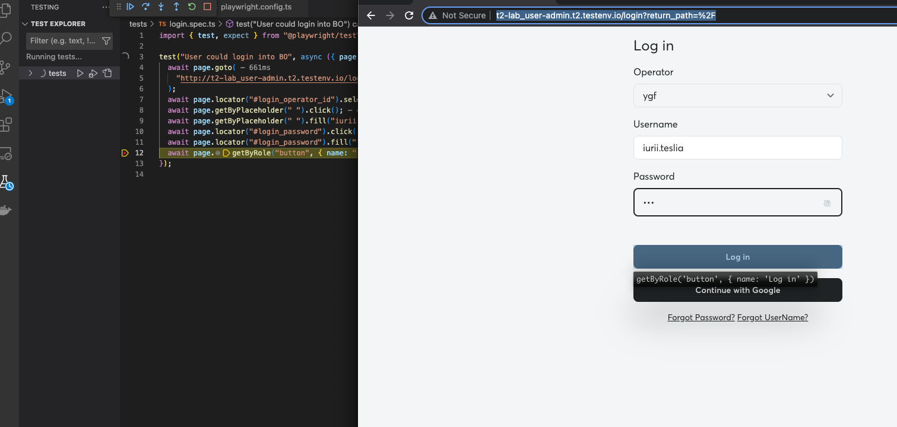

# Record your first PWT test

> Get a start with `recording`.

Playwright provides invaluable "test recording" functionality called `codegen`.

## Record tests via the `playwright` command

Kick off a new `codegen` session with `npx playwright codegen`.

```bash
 npx playwright codegen http://p-lab_user-admin.p.testenv.io/users
```

Record the login process for your user



Copy and paste into your new test file (`./tests/example.spec.js`) and rename it to `./tests/login.spec.js`

## Playwright UI Mode

UI Mode let's you explore, run and debug tests with a time travel experience complete with watch mode=. All test files are loaded into the testing sidebar where you can expand each file and describe block to individually run, view, watch and debug each test.

`Running tests in UI Mode`

```bash
npx playwright test --ui
```

## Playwright VS Code extension

Most of Playwright's CLI functionality is also available via [the official VS Code extension](https://marketplace.visualstudio.com/items?itemName=ms-playwright.playwright).

Install this extention to your VS Code.

### Debugging in VS Code

In some areas, the VS Code extension is more powerful than the terminal because it allows you to inspect variables, set break points and run a single test by clicking a button.



### Assertions in the test

Add any `expect` to the test that `Customers` text is visible

---

## 🏗️ Action item

- [ ] Record a new test for login
- [ ] Debug your test
- [ ] Check that 'Customers' table name is visible

---

Let's speak more about [assertions](./03-assertions.md)!
