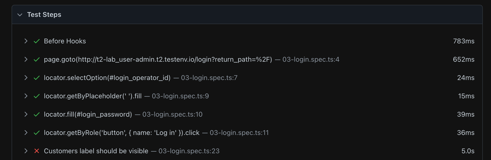

# Check that your site works correctly

> Avoid `waitFor`'s in your code base.

Due to auto-waiting mechanisms, a recorded test case tests many web functionality and critical user flows already. To nail down implementation details and test for data correctness, you need to add assertions.

## Assertion essentials

There are some core things to know about assertions.

### Custom assertion messages

To make your assertions more readable in your test reports. You can also define a custom message.

```typescript
await expect(
  page.getByText("Customers1").nth(1),
  "Customers label should be visible"
).toBeVisible();
```

### Configurable timeouts

Web-first assertions have a timeout config option if things take longer.

```typescript
await expect(page.getByText("Customers").nth(1)).toBeVisible({
  timeout: 10_000,
});
```

> **Note**
> The default timeout is 5s and can be changed on a project basis in your Playwright config under `expect.timeout`.

### Soft assertions

[Soft assertions (`expect.soft`)](https://playwright.dev/docs/test-assertions#soft-assertions) are a handy way to fail your test case but still try to run the following actions.

```typescript
await expect
  .soft(
    page.getByText("Customers1").nth(1),
    "Customers label should be visible"
  )
  .toBeVisible();
```

Soft assertion are particularly helpful when running longer tests.



### Assertions can be negated

Assertions also provide a quick way to flip around their meaning.

```typescript
await expect(locator).toBeVisible();
await expect(locator).not.toBeVisible();
```

## 🏗️ Action item

- [ ] Write additional assertion with custom message
- [ ] Extend your test with assertion that your user name in the header is correct

**Additional Task**

- [ ] Add [slowExpect](https://playwright.dev/docs/test-assertions#expectconfigure) to your test

---

Let's speak more about [locators](./04-locators.md)!
